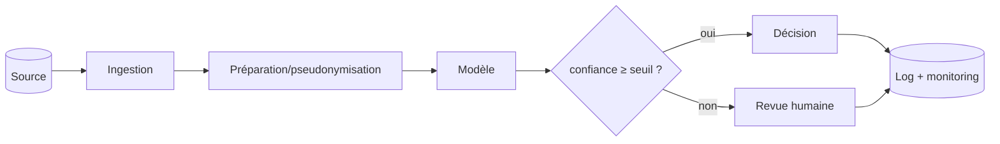

# Schéma d'architecture cible (niveau composants) — Mini-cours

> Brief associé : M8-B1
> Durée de lecture : ~20 min
> Pré-requis : Mermaid (vu en M3/M7)

## Pourquoi cette techno ?

Au cadrage, on dessine l'architecture **au niveau composants** — pas au niveau
code. Le schéma montre les **briques** (ingestion, modèle, stockage, monitoring) et
leurs **flux**, lisible par un décideur. Il sert à valider la cohérence d'ensemble
et à matérialiser la **sobriété** (ce qu'on met / ne met pas). Le détail (stack,
versions) viendra en M8-B2.

## Concepts clés

- **Niveau composants, pas code** : « classifieur de texte », pas
  `LogisticRegression(C=1.0)`. 4-6 composants suffisent.
- **Flux** : les flèches montrent qui appelle quoi, dans quel ordre.
- **Familles, pas stack** : « base relationnelle », « modèle de classification »,
  « conteneur » — le choix précis est M8-B2.
- **Fallback visible** : un nœud de décision (seuil de confiance → revue humaine)
  montre la supervision humaine.
- **Sobriété schématisée** : si pas de RAG, pas de vector DB dans le schéma — et on
  le dit explicitement.
- **Cohérence** : le schéma doit refléter les risques (pseudonymisation visible si
  PII) et les indicateurs (monitoring de la précision).

## Exemple minimal qui tourne

## Exercice guidé

Pour ton cas :
1. Dessine un schéma Mermaid avec **≥ 4 composants** + flux.
2. Ajoute un **nœud de décision** (seuil / revue humaine).
3. Vérifie que le schéma reflète tes risques (pseudonymisation ?) et tes KPI
   (monitoring ?). Liste ce que tu **n'as PAS mis** (sobriété).

## Pièges fréquents

| Piège | Conséquence |
|---|---|
| Schéma au niveau code | Trop détaillé pour un cadrage |
| Choisir la stack précise | C'est M8-B2, pas le cadrage |
| Composants sans flux | Schéma illisible |
| Mettre toutes les briques modernes | Sur-engineering (anti-sobriété) |
| Schéma incohérent avec risques/KPI | Cadrage non aligné |

| Symptôme | Cause probable |
|---|---|
| Le client ne comprend pas le schéma | trop technique / pas de flux clairs |
| Vector DB alors que pas de RAG | sobriété non respectée |
| Pas de pseudonymisation malgré PII | schéma incohérent avec les risques |

## Pour aller plus loin

- Mermaid — flowchart : https://mermaid.js.org/syntax/flowchart.html
- Cf. 3 schémas M7-B2 (ML / RAG / agents) — patrons.

## Vérification (checklist apprenant)

- [ ] Schéma Mermaid niveau **composants** (pas code).
- [ ] ≥ 4 composants + flux.
- [ ] Nœud de décision / fallback visible.
- [ ] Cohérent avec mes risques et mes KPI.
- [ ] Je liste ce que je n'ai **pas** mis (sobriété).

> 💡 **Récap — Schéma archi cible** : niveau **composants** (4-6), pas code ; familles (« base relationnelle »), pas stack ; un nœud de décision (seuil → revue humaine) ; cohérent avec risques et KPI ; **dire ce qu'on n'a pas mis** (sobriété). La stack précise, c'est M8-B2.

### À retenir

- Le livrable se juge sur sa **clarté pour le destinataire**, pas sur sa longueur.
- **Chiffrer** plutôt qu'affirmer : un nombre vaut mieux qu'un adjectif.
- **Sobriété** : recommander le plus simple qui résout le besoin, et **dire ce qu'on écarte**.
- Distinguer ce qu'on **sait** de ce qui reste **à clarifier** (questions ouvertes).
- Tracer ses **choix** et leur **raison** — c'est ce qui se défend en restitution.
