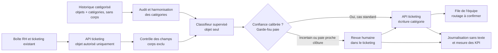

# Schéma d'architecture cible — CapGroup Services (Cas C)

> Schéma de cadrage : familles de composants, sans choix de stack. Le routage effectif après écriture de catégorie reste à confirmer avec la DSI.

**Composants** : source de tickets, API de lecture, prétraitement sécurisé, audit des libellés, classifieur supervisé, seuil de décision avec revue humaine, API d'écriture, files d'équipe et suivi des KPI.

**Garde-fous** : le classifieur reçoit uniquement l'objet ; le corps reste dans le ticketing et n'est ni analysé automatiquement ni journalisé. La DSI/DPO doit confirmer que l'API peut limiter les champs lus et qu'aucun corps n'est transmis ; à défaut, pas de pilote automatique. Les cas incertains et la paie proche de la clôture sont revus par une personne dans l'outil. Les journaux conservent uniquement des métadonnées minimales pour les KPI et la traçabilité.

**Ce qui n'est pas inclus** : LLM génératif, RAG, base vectorielle et agent autonome ; ils ne sont pas nécessaires à une classification de catégories finies et augmenteraient l'exposition des données sensibles. Pas de réentraînement automatique à partir des corrections sans contrôle qualité.