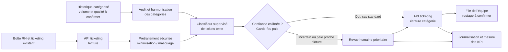

# Schéma d'architecture cible — CapGroup Services (Cas C)

> Schéma de cadrage : familles de composants, sans choix de stack. Le routage effectif après écriture de catégorie reste à confirmer avec la DSI.

**Composants** : source de tickets, API de lecture, prétraitement sécurisé, audit des libellés, classifieur supervisé, seuil de décision avec revue humaine, API d'écriture, files d'équipe et suivi des KPI.

**Garde-fous** : accès limité aux champs nécessaires ; ne pas envoyer de corps à un service externe avant validation DSI/DPO ; seuil de confiance calibré sur un jeu de validation distinct ; traçabilité des changements et corrections. Le routage paie proche de la clôture est priorisé en revue humaine jusqu'à validation d'un délai acceptable.

**Ce qui n'est pas inclus** : LLM génératif, RAG, base vectorielle et agent autonome ; ils ne sont pas nécessaires à une classification de catégories finies et augmenteraient l'exposition des données sensibles. Pas de réentraînement automatique à partir des corrections sans contrôle qualité.